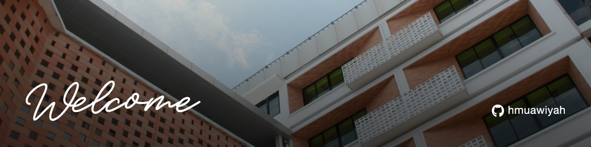

### :wave: Hi there

Helping you build modern full-stack web apps with solid API and database integration. Backed by 2 years in design, I focus on creating products that work smoothly and look clean.

- :computer: Fullstack Web Development  
- :credit_card: Payment Gateway Integration  
- :iphone: Responsive Web  
- :arrows_clockwise: Comfortable working with Agile, Scrum, or Waterfall  
- :handshake: Open to collaboration  

---

### :desktop_computer: Tech Stack

Some of the tech I use to build web apps and I’m always adding more :rocket:

---

### :globe_with_meridians: Connect with Me

---

  
  

